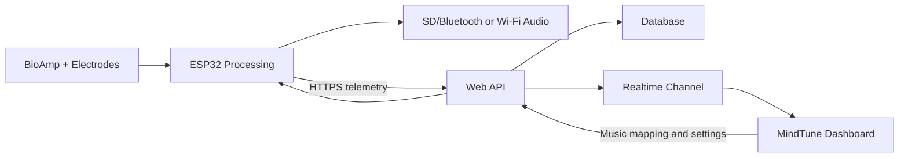

# MindTune Website Plan

## 1. Product Goal

MindTune is an IoT-assisted emotional wellness system. The ESP32 reads EEG data from a
BioAmp EXG Pill, derives brainwave-band values, classifies one of five emotional states, and
selects suitable music.

The website should make the device understandable and useful by giving the user:

- Live device and electrode status
- Current detected emotion and confidence
- Live EEG band-power visualization
- Current therapy track and playback status
- Session history and mood trends
- Per-emotion music preferences
- Device setup, calibration, and troubleshooting

The site must describe the output as wellness information, not a medical diagnosis.

## 2. Recommended Product Shape

Build one responsive web application with two areas:

### Public Website

- Home
- How It Works
- Device / Hardware
- Research and Results
- Safety and Privacy
- Sign In / Create Account

### Signed-In Dashboard

- Overview
- Live Session
- Session History
- Analytics
- Music Preferences
- Devices
- Profile and Settings
- Help

For the first version, prioritize the signed-in dashboard. The public pages can remain small.

## 3. Core User Journey

1. User creates an account.
2. User pairs or registers a MindTune device using a device code.
3. User checks electrode contact and completes a short calibration.
4. User starts a session.
5. The ESP32 sends a reading approximately every five seconds.
6. The dashboard shows emotion, confidence, signal quality, EEG bands, and music.
7. Music changes when the detected emotion changes.
8. User ends the session and sees a summary.
9. The session becomes available in history and analytics.

## 4. Sitemap and Page Structure

### `/`

Public landing page:

- Hero: "Understand your state. Tune your environment."
- Short product explanation
- Five-step system flow
- Five supported emotional states
- Hardware overview
- Project results: 79% reported classification accuracy and 1.8-second average response
- Privacy-first local processing message
- Clear research-prototype disclaimer
- Sign-in and dashboard calls to action

### `/how-it-works`

- EEG acquisition
- Signal preprocessing
- Delta, theta, alpha, beta, and gamma explanation
- Emotion-classification overview
- Music-therapy mapping
- Data flow and privacy explanation

### `/device`

- ESP32, BioAmp EXG Pill, electrodes, SD card, Bluetooth/Wi-Fi
- Electrode placement guide
- System requirements
- Setup and troubleshooting

### `/research`

- Project objective
- Methodology
- Test process
- Results and limitations
- Future improvements

Avoid presenting the report's small volunteer study as clinical validation.

### `/login` and `/register`

- Email/password or magic-link authentication
- Password reset
- Terms and privacy acknowledgement

### `/dashboard`

At-a-glance overview:

- Device connection card
- Current emotion card
- Signal quality card
- Current music card
- Start Session button
- Today's emotion distribution
- Recent sessions
- Seven-day mood trend

### `/dashboard/live`

Primary real-time screen:

- Session timer and start/stop controls
- Current emotion with color and icon
- Confidence percentage
- Electrode contact / signal quality
- Device online status and battery
- Five live EEG-band bars
- Rolling band-power chart
- Current music and reason for selection
- Emotion timeline
- Pause or override music
- Calibration status

The live view should remain calm and readable. Raw numbers belong in secondary details.

### `/dashboard/sessions`

- Searchable session list
- Date, duration, dominant emotion, average confidence, and signal quality
- Filters by date and emotion
- Empty, loading, offline, and error states

### `/dashboard/sessions/[sessionId]`

- Session summary
- Emotion timeline
- Emotion distribution
- Average EEG-band values
- Track-change timeline
- Signal-quality warnings
- Optional user note and self-reported mood
- Export as CSV later

### `/dashboard/analytics`

- Daily and weekly emotion distribution
- Calm versus high-arousal trend
- Average confidence
- Session duration trend
- Music-response statistics
- Time-of-day patterns

These are wellness trends, not health conclusions.

### `/dashboard/music`

- One music choice for each detected emotion
- Happy, Sad, Anxiety, Calm, and Anger mappings
- Track preview
- Genre and intensity preferences
- Reset to recommended defaults

### `/dashboard/devices`

- Registered devices
- Online/offline state
- Last seen
- Firmware version
- Battery level
- Pair, rename, or remove a device
- Wi-Fi and Bluetooth setup guidance

### `/dashboard/settings`

- Profile
- Units and display preferences
- Data retention
- Download data
- Delete account and readings
- Privacy controls

### `/help`

- Electrode placement
- Poor-signal troubleshooting
- Device connection help
- Music playback help
- Safety guidance
- Frequently asked questions

## 5. Live Dashboard Layout

Desktop:

```text
+--------------------------------------------------------------+
| MindTune | Device Online | Session 08:42 | Stop Session      |
+----------------------+----------------------+----------------+
| Current Emotion      | Signal Quality       | Now Playing    |
| CALM                 | Good                 | Ambient Focus  |
| Confidence: 84%      | Battery: 76%         | Pause / Change |
+----------------------+----------------------+----------------+
| EEG Band Power: Delta | Theta | Alpha | Beta | Gamma         |
+--------------------------------------------------------------+
| Rolling EEG chart                                            |
+--------------------------------------+-----------------------+
| Emotion timeline                     | Session insights      |
+--------------------------------------+-----------------------+
```

Mobile:

- Stack the same cards vertically.
- Keep emotion, signal quality, and session controls above the fold.
- Put detailed EEG charts in expandable sections.

## 6. Emotion Presentation

Use a consistent visual language without implying that an emotion is "bad":

| Emotion | Suggested color | Music response |
| --- | --- | --- |
| Happy | Warm yellow | Gentle ambient or preference |
| Sad | Soft blue | Uplifting major-mode music |
| Anxiety | Muted violet | Slow calming instrumental |
| Calm | Teal/green | Nature or ambient soundscape |
| Anger | Warm coral | Gentle, low-arousal music |

Always pair color with text and an icon for accessibility.

## 7. Required Device Integration

The report currently demonstrates Serial output and two playback approaches:

1. Wi-Fi HTTP requests to a music server.
2. Local SD-card audio streamed to Bluetooth headphones.

Neither approach by itself sends live measurements to a website. The firmware needs a telemetry
addition. For the MVP, the simplest path is for the ESP32 to send HTTPS JSON to an ingestion API
after each classification cycle.

### Suggested telemetry request

`POST /api/v1/telemetry`

```json
{
  "deviceId": "MT-001",
  "recordedAt": "2026-06-10T10:30:00Z",
  "sessionId": "session-uuid",
  "emotion": "CALM",
  "confidence": 0.84,
  "bands": {
    "delta": 12.4,
    "theta": 18.9,
    "alpha": 31.7,
    "beta": 14.2,
    "gamma": 7.1
  },
  "metrics": {
    "attention": 0.45,
    "relaxation": 1.26,
    "engagement": 0.72,
    "arousal": 0.41,
    "valence": 0.18,
    "focus": 0.52,
    "stress": 0.38,
    "drowsiness": 0.24
  },
  "signalQuality": 0.91,
  "electrodesConnected": true,
  "batteryPercent": 76,
  "track": "calm.wav",
  "firmwareVersion": "4.2"
}
```

The API stores the reading and broadcasts it to the user's open dashboard. Keep music playback on
the device for the MVP; the website observes and configures it.

## 8. System Architecture



Recommended implementation:

- Frontend and server routes: Next.js with TypeScript
- UI: Tailwind CSS and a small accessible component system
- Authentication and database: Supabase Auth + PostgreSQL
- Live updates: Supabase Realtime
- Charts: Recharts
- Hosting: Vercel for the web application

For a local-only demonstration, the same UI can start with a mock telemetry generator before the
ESP32 connection is added.

## 9. Data Model

### `profiles`

- `id`
- `display_name`
- `timezone`
- `created_at`

### `devices`

- `id`
- `user_id`
- `device_code`
- `name`
- `firmware_version`
- `last_seen_at`
- `battery_percent`
- `status`

### `sessions`

- `id`
- `user_id`
- `device_id`
- `started_at`
- `ended_at`
- `dominant_emotion`
- `average_confidence`
- `average_signal_quality`
- `note`

### `readings`

- `id`
- `session_id`
- `recorded_at`
- `emotion`
- `confidence`
- `delta`
- `theta`
- `alpha`
- `beta`
- `gamma`
- `signal_quality`
- `electrodes_connected`
- optional derived metrics

### `music_preferences`

- `id`
- `user_id`
- `emotion`
- `track_name`
- `track_uri`
- `enabled`

### `music_events`

- `id`
- `session_id`
- `reading_id`
- `emotion`
- `track_name`
- `started_at`
- `status`

## 10. API Surface

- `POST /api/v1/devices/register`
- `POST /api/v1/telemetry`
- `POST /api/v1/sessions/start`
- `POST /api/v1/sessions/[id]/stop`
- `GET /api/v1/sessions`
- `GET /api/v1/sessions/[id]`
- `GET /api/v1/music-preferences`
- `PUT /api/v1/music-preferences/[emotion]`
- `GET /api/v1/devices/[id]/config`

Each device should use its own revocable API key. Never place a user's login token in firmware.

## 11. Privacy, Safety, and Trust

- Treat EEG readings as sensitive personal data.
- Use HTTPS for device telemetry.
- Apply per-user database access rules.
- Store only processed band powers by default, not raw EEG samples.
- Let users delete sessions and their account data.
- Show clear online/offline and poor-signal states.
- Do not claim diagnosis, treatment, or guaranteed mood improvement.
- Include a message that the system is not for emergencies.
- Avoid alerts that could frighten users based on a single classification.

## 12. MVP Scope

Build first:

- Responsive dashboard shell
- Demo login
- Overview page
- Live-session page using simulated readings
- Emotion and EEG charts
- Session history and detail
- Music-preference mapping
- Device-status page
- Telemetry API contract
- Research-prototype and privacy messaging

Defer until the core flow works:

- Healthcare-provider portal
- Smart-home control
- Native mobile app
- Multi-channel EEG
- Clinical alerts
- Machine-learning retraining
- Full raw EEG storage

## 13. Build Phases

### Phase 1: Clickable UI Prototype

- Establish visual design
- Build all main routes with realistic mock data
- Validate desktop and mobile flows

### Phase 2: Application Foundation

- Add authentication and database
- Implement sessions, readings, devices, and music preferences
- Add access-control rules

### Phase 3: Live Data

- Add telemetry ingestion
- Add realtime dashboard updates
- Add offline, stale-data, and reconnect behavior

### Phase 4: Firmware Connection

- Add JSON telemetry to the ESP32 firmware
- Add device API-key provisioning
- Test five-second updates and connection recovery

### Phase 5: Verification and Deployment

- Accessibility and responsive testing
- Security and privacy checks
- End-to-end device test
- Deploy the web app and document setup

## 14. First Implementation Target

The best first milestone is a polished, responsive live dashboard powered by a simulator. It lets
us settle the user experience and charts before device networking makes debugging more complex.
Once the screen feels right, the simulator payload becomes the exact contract used by the ESP32.
